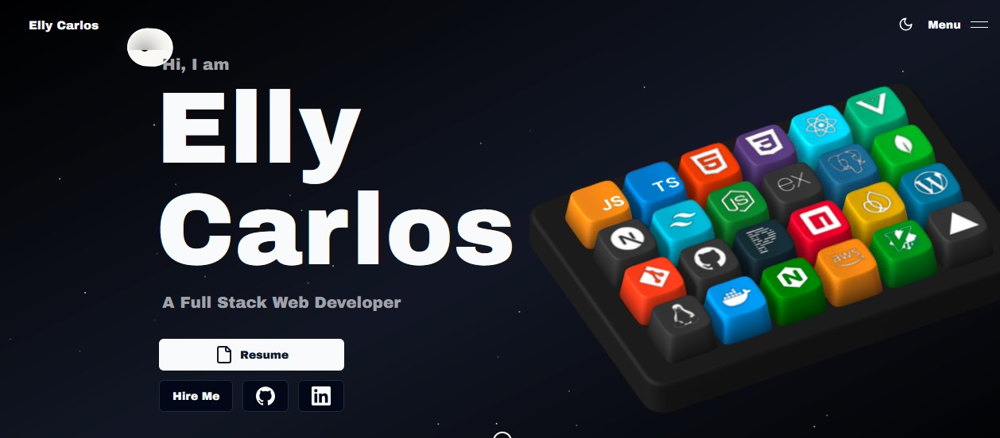

<div align="center">

# ✦ Elly Carlos — Portfolio

**Full-Stack Software Engineer · Nairobi, Kenya**

[](https://ellycarlos.vercel.app)
[](https://nextjs.org)
[](https://www.typescriptlang.org)
[](LICENSE)

A personal portfolio website featuring custom 3D animations, immersive scroll interactions, and a space-themed UI — built to stand out.



</div>

---

## ✦ Live Demo

🌐 **[ellycarlos.vercel.app](https://ellycarlos.vercel.app)**

---

## ✦ Features

- **3D Interactive Keyboard** — Built with Spline; each keycap represents a skill and reveals details on hover
- **Scroll & Reveal Animations** — Powered by GSAP and Framer Motion for fluid, cinematic transitions
- **Space Theme** — Particle-based cosmic background that brings the page to life
- **Fully Responsive** — Optimised across mobile, tablet, and desktop
- **Contact Form** — Email delivery powered by Resend with Zod schema validation
- **Type-Safe Codebase** — 96.9% TypeScript for a robust, maintainable architecture

---

## ✦ Tech Stack

| Layer | Technologies |
|---|---|
| **Framework** | Next.js 15, React |
| **Language** | TypeScript |
| **Styling** | Tailwind CSS, SCSS, Shadcn UI, Aceternity UI |
| **Animations** | GSAP, Framer Motion, Spline Runtime |
| **Email** | Resend |
| **Validation** | Zod |
| **Deployment** | Vercel |

---

## ✦ Projects Showcased

### NexusChat — Real-Time Messaging Platform
> Next.js · TypeScript · Node.js · Express · Socket.IO · PostgreSQL · Prisma

A full-stack messaging application with private and group conversations, media sharing, voice notes, calls, authentication, account recovery, and real-time communication.

---

### E-Commerce MERN Platform
> MongoDB · Express.js · React.js · Node.js · Redux Toolkit · Material-UI

A complete shopping platform with JWT authentication, admin dashboard, product reviews, wishlists, and order tracking.

---

## ✦ Getting Started

### Prerequisites

- Node.js v14+
- npm or yarn

### Installation

```bash
# 1. Clone the repository
git clone https://github.com/EllyCarlos/Portfolio.git

# 2. Navigate into the project
cd Portfolio

# 3. Install dependencies
yarn install

# 4. Start the development server
yarn dev
```

Open [http://localhost:3000](http://localhost:3000) in your browser.

### Environment Variables

Create a `.env.local` file in the root directory and add the following:

```env
RESEND_API_KEY=your_resend_api_key
```

---

## ✦ Deployment

This site is deployed on **Vercel**. To deploy your own fork:

1. Push your code to a GitHub repository
2. Import the repository on [vercel.com](https://vercel.com)
3. Add your environment variables in the Vercel dashboard
4. Deploy — Vercel handles the rest

---

## ✦ Project Structure

```
portfolio/
├── public/
│   └── assets/
│       └── projects-screenshots/   # Project preview images
├── src/
│   ├── app/                        # Next.js app router pages
│   ├── components/                 # Reusable UI components
│   └── lib/                        # Utility functions & config
├── tailwind.config.ts
├── next.config.mjs
└── tsconfig.json
```

---

## ✦ Contributing

Suggestions and improvements are always welcome.

1. Fork the repository
2. Create a feature branch: `git checkout -b feature/your-idea`
3. Commit your changes: `git commit -m 'Add: your idea'`
4. Push to the branch: `git push origin feature/your-idea`
5. Open a Pull Request

---

## ✦ Connect

| Platform | Link |
|---|---|
| 🌐 Portfolio | [ellycarlos.vercel.app](https://ellycarlos.vercel.app) |
| 💼 LinkedIn | [linkedin.com/in/elly-carlos](https://www.linkedin.com/in/elly-carlos) |
| 🐙 GitHub | [github.com/EllyCarlos](https://github.com/EllyCarlos) |
| 📧 Email | [ellycarlos97@gmail.com](mailto:ellycarlos97@gmail.com) |

---

## ✦ License

This project is open source and available under the [MIT License](LICENSE).

---

<div align="center">

Made with ☕ in Nairobi, Kenya

⭐ If you like what you see, drop a star — it helps more than you think!

</div>
